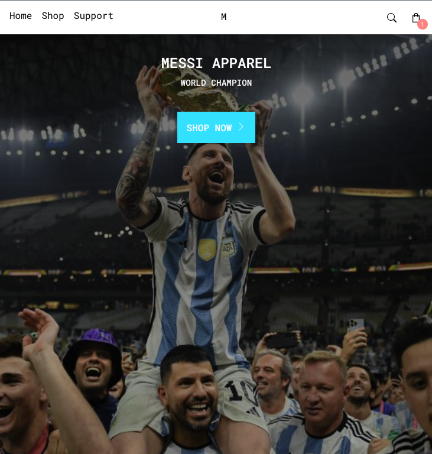

# shopping-cart

## [Live Demo](https://salvantjeff.github.io/shopping-cart/)

## Introduction

Developed an e-commerce based react application with a focus on applying page routing. It was interesting tackling how to dynamically route users based on their selected shopping items. Planning in the early stages was key to my success, for instance determining how I would set up the routes. However, it was challenging to figure out how I would structure the dataset used but doing so improved the project significantly by making the codebase more easily maintainable and extendable. 

### Languages and Tools used:

